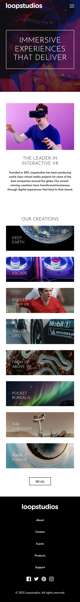

# Frontend Mentor - Loopstudios landing page solution

This is a solution to the [Loopstudios landing page challenge on Frontend Mentor](https://www.frontendmentor.io/challenges/loopstudios-landing-page-N88J5Onjw). Frontend Mentor challenges help you improve your coding skills by building realistic projects.

## Table of contents

- [Overview](#overview)
  - [The challenge](#the-challenge)
  - [Screenshot](#screenshot)
  - [Links](#links)
- [My process](#my-process)
  - [Built with](#built-with)
  - [What I learned](#what-i-learned)
  - [Continued development](#continued-development)
  - [Useful resources](#useful-resources)
- [Author](#author)

## Overview

### The challenge

Users should be able to:

- View the optimal layout for the site depending on their device's screen size
- See hover states for all interactive elements on the page

### Screenshot

### Links

- Solution URL: [https://github.com/jarren15/loopstudios-landing-page-challenge](https://github.com/jarren15/loopstudios-landing-page-challenge)
- Live Site URL: [https://loopstudios-landing-page-challenge-five.vercel.app/](https://loopstudios-landing-page-challenge-five.vercel.app/)

## My process

### Built with

- Next.js
- SCSS
- Google Fonts
- BEM & SMACSS Methodologies
- Vercel

### What I learned

1. **Integrating Google Fonts in Next.js**  
   I learned how to seamlessly integrate Google Fonts into a Next.js application.

2. **Using SCSS in Next.js**  
   I gained experience with styling Next.js applications using SCSS. This included configuring the project to support SCSS and taking advantage of its features like variables, nesting, and mixins to create cleaner and more maintainable styles.

3. **Code Splitting in Next.js**  
   I explored the power of code splitting within Next.js by leveraging its built-in folder structure.

4. **Passing Data with Props**  
   I learned the importance of using props to pass data between components in React. This made it easier to manage the flow of data and maintain reusability across the application.

5. **Using React Hooks**  
   I gained hands-on experience with React hooks, such as `useState` and `useEffect`, to manage state and lifecycle methods in functional components.

6. **Deploying to Vercel**  
   I successfully deployed the application to Vercel, which gave me practical experience with modern deployment workflows and introduced me to the benefits of serverless hosting and continuous deployment.

### Continued development

Moving forward, I aim to deepen my skills in styling with CSS Modules and styled-components, optimize font loading for better performance, and implement dynamic routing with API integration. I also plan to explore advanced state management techniques and focus on creating reusable, scalable components to enhance overall application architecture. Additionally, having deployed the project on Vercel, I'm interested in learning more about deployment workflows, performance monitoring, and CI/CD best practices.

### Useful resources

- [Next.js](https://nextjs.org/)
- [Vercel](vercel.com)
- [Google Fonts](https://fonts.google.com/)

## Author

- Website - [John Arren Novilla](https://jarrendevs.webflow.io/)
- Frontend Mentor - [@jarren15](https://www.frontendmentor.io/profile/jarren15)
- LinkedIn - [John Arren Novilla](https://www.linkedin.com/in/john-arren-novilla-bb815b160/)
